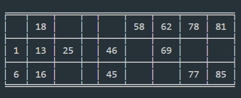

# Housie Ticket Generator
Generates **_Housie Tickets_** Using _Python_ 

To **run** the code:
 - Clone repository [using Command Line](https://help.github.com/en/github/creating-cloning-and-archiving-repositories/cloning-a-repository#cloning-a-repository-using-the-command-line).
 - After cloning, you will need to install python library _"tabulate"_ using `pip install tabulate` 
 - Run the **code.py** file using `python code.py` 

This code prints the ticket in the _console_.
You will get the ticket similar to the given image.

